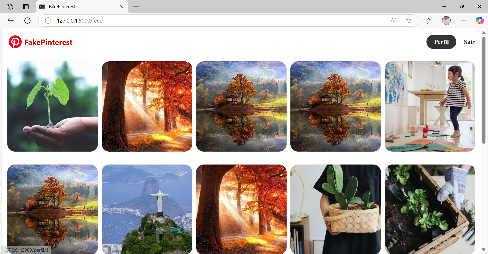

# 🖼️ Pinterest Clone com Flask

Um projeto web desenvolvido com Python para simular a experiência de uso do Pinterest.

## 🚀 Tecnologias Utilizadas
- Python 3
- Flask
- HTML & CSS
- Jinja2

## 🎯 Funcionalidades
- Upload de imagens
- Visualização em grade (estilo Pinterest)
- Organização por categorias
- Página inicial responsiva

## 📸 Demonstração



## 🧠 Aprendizados
Durante esse projeto, aprimorei minhas habilidades com Flask, especialmente em:
- Estruturação de rotas
- Criação de templates dinâmicos com Jinja2
- Integração frontend-backend
- Organização de arquivos estáticos

## 📁 Como rodar o projeto localmente

```bash
git clone https://github.com/JulioFigueiredo/Projeto_Pinterest.git
cd Projeto_Pinterest
python -m venv venv
venv\Scripts\activate
pip install -r requirements.txt
python main.py
```